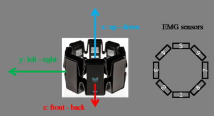
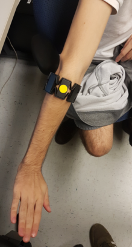

# pose_recognition

This project aims to build a platform to train and deploy classifiers for hand movement recognition.

All the developed functionalities rely on the extraction of EMG data from sensors placed on the arm. During development, the [myo armband](https://support.getmyo.com/hc/en-us/articles/203398347-Getting-started-with-your-Myo-armband) was used for acquiring EMG signals. It can be noted that there are plenty of alternatives in terms of acquisition hardware, but in all cases, the user should be aware of the important specs (sampling frequency, bandwidth, ...).

It should also be noted that this project relies on the [Neural-Space Pewter](https://github.com/Neural-Space/pewter) tool for the acquisition, storage, and visualization of raw EMG signals. The tool really facilitates the usage of the Myo armband and provides an intuitive UI. Modifications would need to be made if this project was to turn towards other signal acquisition hardware.

The core files of the project (the ones located in the package) offer functionalities in terms of raw data selection, signal processing, feature extraction, data labeling, data visualization, etc ... 

The other files serve as examples of how to use the different functionalities offered by the core files.

Finally, a pickled classifier and feature extraction pipeline are provided in the project files to allow OTB movement classification.

##### Architecture

### Example files

##### process_raw_data.py
This code sample transforms raw EMG acquisition files to acquisition files that contain only useful information in terms of movement recognition. In other words, the code cuts unnecessary data from the file leaving only a window of data which is considered useful.
Currently, the code only keeps the window of data which corresponds to a hand pose being held. This means that the system can recognize a pose being held but not the transition from a pose to another. The picture below provides a more visual explanation.  
**It is important to note that the code modifies all the acquisition files in the provided folder path, so there should be a folder dedicated to processed training data and another one for raw training data. This will reduce the chances of accidentally destroying the raw training data.**

Note that this figure displays the signal only from one of the 8 sensors on the myo armband.

##### live_classification.py
This code sample can be used to run OTB hand movement classifications.
The code starts by restoring the pickled classifier and extraction pipeline from the project folder. After the restoration, communication with the armband is established via the [emg_comm](../emg_comm/) package. 
A client function and an observer function are then defined in order to perform movement classifications and relay the results to a shared Redis database.
Finally, the acquisition is started and the defined functions are launched through an EMGProcessManager instance provided by the emg_com package.

##### model_training.py
This code sample trains a classification pipeline composed of a feature extraction layer and an SVM.
The example starts by collecting all the locally stored training files and generating a shuffled feature-set list with a corresponding label list. Once the training data is collected, the classification pipeline is trained and it's components stored in the project folder.
When it comes to managing the locally stored training files these files have to be organized as specified in the "Managing training files" section.

##### parameter_search.py
This code sample builds, trains and evaluates the classification pipeline while using a parameter grid to select hyperparameter values at the building step. The parameter grid is defined by the user and can specify values for the parameters listed below. Once all hyperparameter configurations have been evaluated, the results are saved to the project folder. These results come in the shape of an accuracy ranking, which ranks the parameter configurations from best to worst. 
It should be noted that when each pipeline iteration is evaluated, the Kfold method is used with k = 3.

###### Pipeline hyperparameters 
* n_avgs: number of averages to compute per channel
* dwt: enable Discrete Wavelet Analysis
* level: specifies the maximal level for wavelet decomposition (level=2 : levels 1 and 2 will be computed)
* variance: training set variance to be maintained at the PCA level

###### Displaying search results in Jupyter notebook

    import pandas as pd
    import pickle

    result_file = "path/to/search_results.pickle"

    with open(result_file, 'rb') as f_handle:
        data_dict = pickle.load(f_handle)
        result_frame = pd.DataFrame.from_dict(data_dict)
        result_frame = result_frame[['params','split0_test_score', 'split1_test_score', 'split2_test_score', 'rank_test_score']]
        result_frame.sort_values(by=['rank_test_score'])
        display(result_frame)

### Managing training files
The code samples depend on the "Training_data.json" file to get information about the movements meant to be classified by the system. The file details the necessary information for every movement so that it may be classified.
Amongst the movement information is the "directory_path" field which tells the system where to get the training files needed to learn a specific movement. The provided path should be an absolute path to the directory containing the training .json files.

The training data directory for a movement should have the layout detailed below
###### Training/Testing data layout
+ Some relative path/
    + movement_name/
        + movement_name_1_1.json
        + movement_name_1_2.json
        + movement_name_1_n.json
        + ... 
        + movement_name_2_1.json
        + movement_name_2_2.json
        + movement_name_2_n.json
        + ...
        + movement_name_m_1.json
        + movement_name_m_2.json
        + movement_name_m_n.json

As shown above, the naming convention for a training file is: movement_name_(acquisition_batch)\_(acquisition_number)

**Note that all the acquisition files generated during development are provided in the "Training_data.zip" file. All these acquisitions come from a single candidate, so to obtain a model that can generalize better, you should include acquisitions done on your own arm.**

### Creating training data

**When it comes to performing the acquisitions, a protocol was established to ensure consistent results.**

As mentioned earlier, the acquisition of EMG data was done with the [Pewter](https://github.com/Neural-Space/pewter) tool, which in turn depends on the [Myo connect](https://support.getmyo.com/hc/en-us/articles/360018409792) software.

##### Placement of the arm band
Band details             |  Band position
:-------------------------:|:-------------------------:
  |  

The yellow sticker placed on the Myo (right picture) corresponds to the sensor no.8 (left picture). Also, the USB port on the band should be pointing towards the user's hand.  

##### Acquisition sequence
As seen on the "Signal anatomy" figure, the acquisition data is divided into two stages: a resting stage and active stage. This is because we followed a protocol when acquiring training data : 
* Place hand in a relaxed position (no strain in the muscles) for about 1 second.
* Place hand in the wanted pose and hold the pose for about 2 seconds.
 
We chose this approach because it makes it easier to isolate the wanted data during preprocessing and because it ensures consistency throughout the data set.

### Package dependencies
This project needs the [emg_comm](../emg_comm/) package to be installed. Follow the link to get installation steps.

### System requirements
    - linux (ubuntu)
    - Python3.6
    - pip3 (sudo apt-get install python3-pip)
    - redis server (sudo apt-get install redis-server)

### Installing python requirements
    - pip3 install -r requirements.txt
    
### Installing the pose_recognition package
    - Copy the "pose_recognition" folder from the main project folder
    - Paste the folder in the wanted location (ex: Downloaded modules folder) 
    - From the command line, navigate to the pasted folder
    - pip3 install --user -e pose_recognition